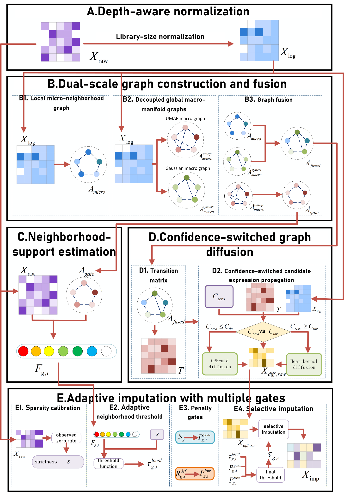

# FGMDI

**FGMDI: Single-cell RNA-seq Data Imputation via Fast Graph-fusion and Multi-gate Diffusion**

FGMDI is a graph-based scRNA-seq imputation method that integrates dual-scale graph construction, neighborhood-support estimation, confidence-switched diffusion, and adaptive multi-gate selective imputation.

## Overview

<p align="center">
  
</p>

The framework contains five stages:

1. Depth-aware normalization;
2. Dual-scale graph construction and fusion;
3. Neighborhood-support estimation;
4. Confidence-switched graph diffusion;
5. Adaptive imputation with multiple gates.

## Repository files

```text
FGMDI_overview.png
README.md
example_cell_label.csv
example_count_matrix.csv
__init__.py
config.py
preprocessing.py
graph_construction.py
diffusion.py
imputation.py
evaluation.py
main.py
requirements.txt
```

## Requirements

- Python 3.8+
- NumPy
- pandas
- SciPy
- scikit-learn
- Scanpy

Install the dependencies with:

```bash
pip install -r requirements.txt
```

## Input format

The input CSV file must contain a non-negative raw count matrix:

- rows: genes;
- columns: cells;
- first column: gene identifiers.

Example:

```csv
Gene,Cell_1,Cell_2,Cell_3
Gene_1,0,2,1
Gene_2,4,0,3
Gene_3,0,1,0
```

## Quick start

Run the included example:

```bash
python main.py \
  --input example_count_matrix.csv \
  --output FGMDI_imputed.csv \
  --diagnostics FGMDI_diagnostics.json
```

Windows PowerShell:

```powershell
python main.py --input example_count_matrix.csv --output FGMDI_imputed.csv --diagnostics FGMDI_diagnostics.json
```

## Python usage

```python
import pandas as pd
from imputation import FGMDI

count_df = pd.read_csv(
    "example_count_matrix.csv",
    index_col=0,
)

model = FGMDI()
imputed_df, diagnostics = model.fit_transform(
    count_df,
    return_diagnostics=True,
)

imputed_df.to_csv("FGMDI_imputed.csv")
print(diagnostics)
```

## Main parameters

| Parameter | Default | Description |
|---|---:|---|
| `k_micro` | 5 | Local cosine-neighborhood size |
| `k_macro` | 30 | Macro-manifold neighborhood size |
| `fusion_alpha` | 0.6 | Weight of the macro graph |
| `confidence_threshold` | 0.281878 | Diffusion-switch threshold |
| `heat_t` | 3.0 | Heat-kernel diffusion time |
| `heat_order` | 8 | Heat-kernel truncation order |
| `base_threshold` | 0.15 | Base imputation threshold |
| `max_threshold` | 0.92 | Maximum adaptive threshold |

## Output

FGMDI produces:

- an imputed genes-by-cells CSV matrix;
- a diagnostic JSON file recording the selected diffusion branch, confidence score, sparsity mode, graph statistics, and number of imputed zeros.

Observed nonzero entries are retained, and only selected zero entries are replaced.

## Evaluation

`evaluation.py` provides PCC, L1 distance, RMSE, ARI, NMI, Purity, and F1:

```bash
python evaluation.py \
  --true true_matrix.csv \
  --masked masked_matrix.csv \
  --imputed FGMDI_imputed.csv \
  --clusters 7
```

## Citation

Please cite the accompanying manuscript when using this code:

> Haobo Fang, Gaoshi Li, Shijun Huang, Bin Wang, Jingli Wu, Jiafei Liu, Haize Hu, and Yaqun Yu. FGMDI: Single-cell RNA-seq Data Imputation via Fast Graph-fusion and Multi-gate Diffusion.

## Note

The current implementation converts the fused transition matrix to a dense NumPy array. It is therefore primarily suitable for small- and medium-scale cell matrices.
